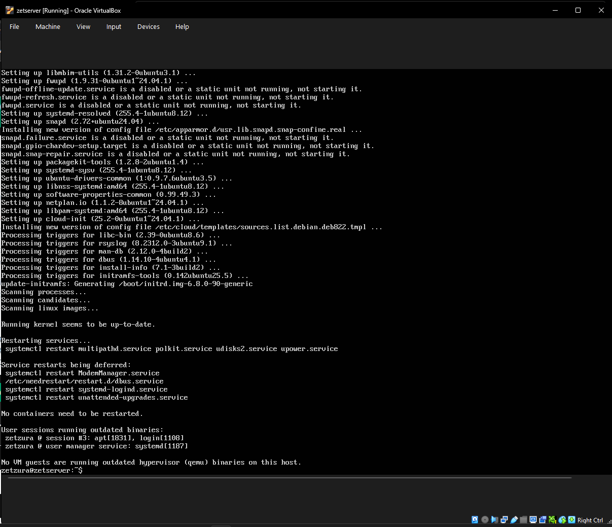
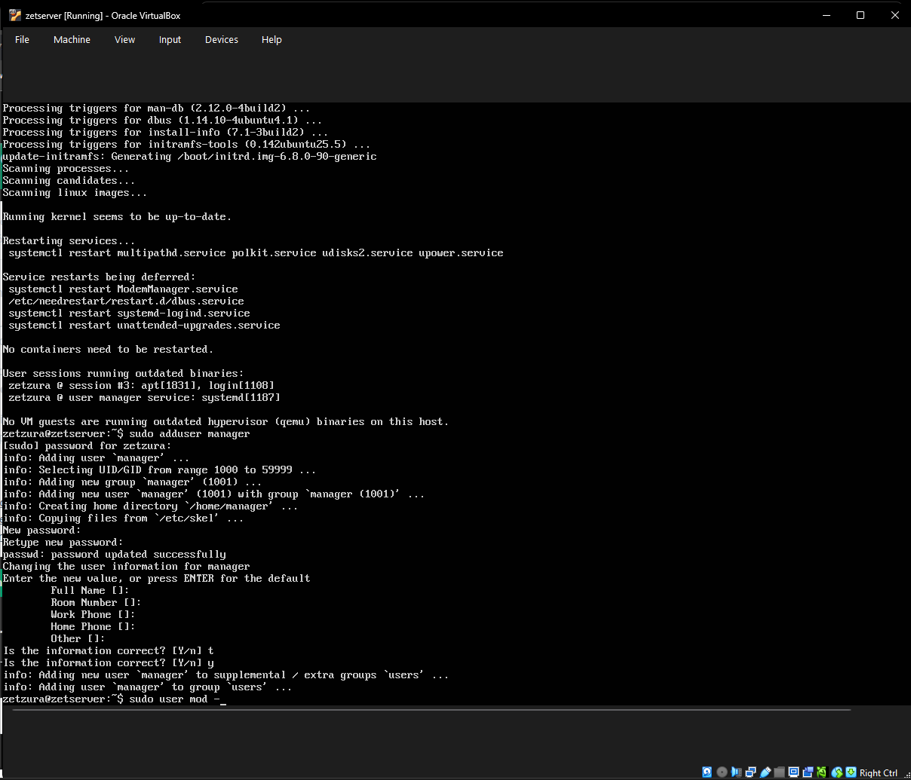
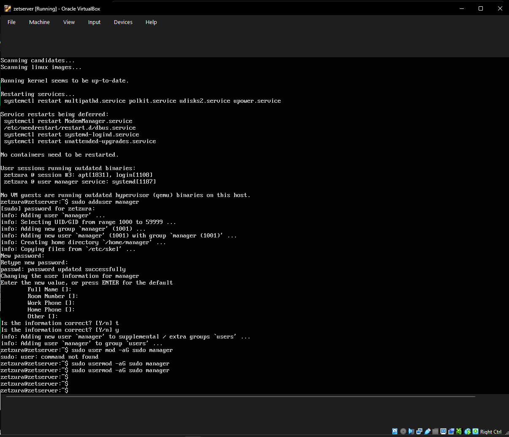
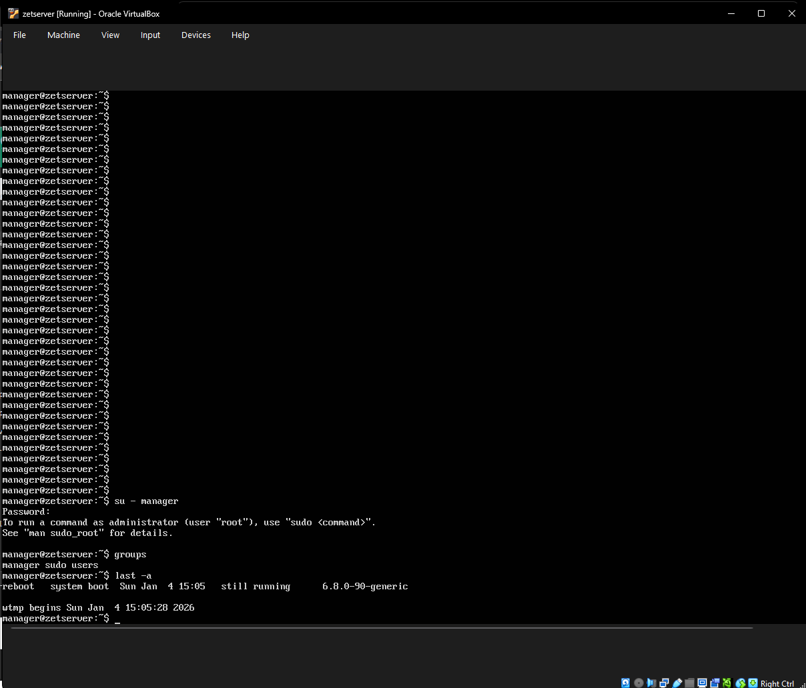

# Week 2 – Security Planning & User Management

## 1. Security Strategy
This week focused on implementing the **Principle of Least Privilege**. By creating a dedicated user for administration and restricting 'root' usage, we ensure that the system is more secure against accidental or unauthorized changes.

## 2. User & Group Implementation
I performed the following terminal operations to configure the server's user environment.

### A. Creating the Administrative User
I created the `zetzura` account to serve as the primary system administrator.
* **Command used:** `sudo adduser zetzura`

### B. Granting Sudo Privileges
To allow the new user to run administrative tasks, I added them to the `sudo` group.
* **Command used:** `sudo usermod -aG sudo zetzura`
* **Verification command:** `groups zetzura`

### C. Removing Temporary Accounts
To reduce security risks, I removed the `manager` account that was used during the testing phase.
* **Command used:** `sudo deluser --remove-home manager`

### D. Final System Audit
I performed a final check to ensure the user list and group permissions were correctly applied.
* **Command used:** `getent group sudo`

---
[Back to Home](./index.html)
