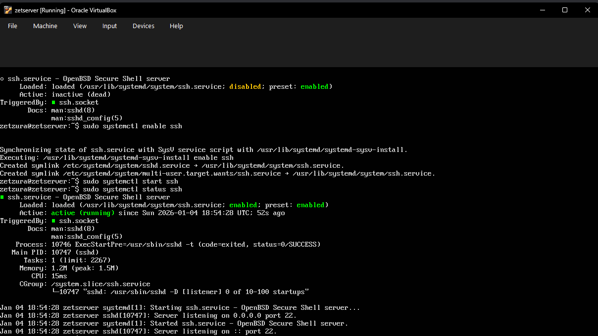
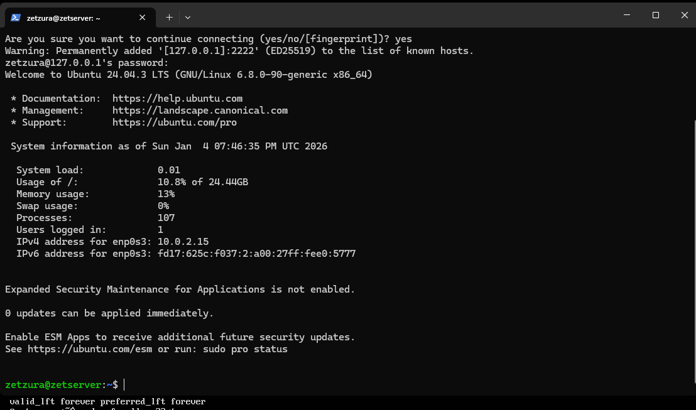
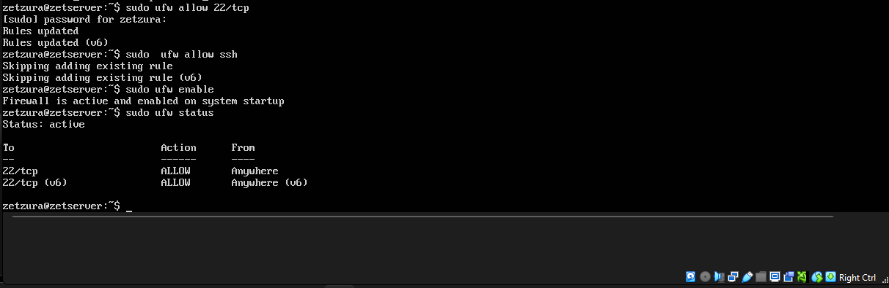

M# Week 3 – Remote Access & System Hardening

## 1. Objective
The goal for this week was to configure secure remote access to the server using SSH and to implement a firewall (UFW) to protect the system from unauthorized network traffic.

## 2. Remote Access Configuration (SSH)
I installed and configured the OpenSSH server to allow management from a remote Windows terminal.
* **Installation:** `sudo apt install openssh-server -y`
* **Port Forwarding:** Since the VM is on a NAT network, I mapped host port `2222` to guest port `22`.

*Above: Verifying that the SSH service is active and running.*

## 3. Remote Connection Test
I verified the connection using Windows PowerShell to ensure the port forwarding and credentials were correct.
* **Command:** `ssh zetzura@127.0.0.1 -p 2222`

*Above: Successful remote login to the Ubuntu server from the host machine.*

## 4. Firewall Hardening (UFW)
To secure the server, I enabled the Uncomplicated Firewall (UFW) and specifically allowed only SSH traffic.
* **Allow SSH:** `sudo ufw allow ssh`
* **Enable Firewall:** `sudo ufw enable`
* **Status Check:** `sudo ufw status verbose`

*Above: Screenshot showing the firewall is active and only allowing port 22/tcp.*

---
[Back to Home](./index.html)
