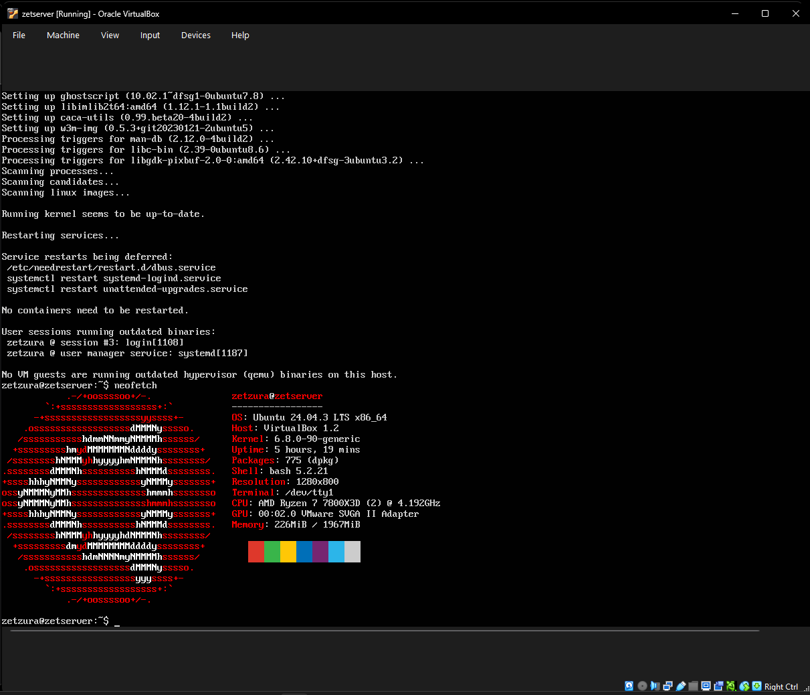
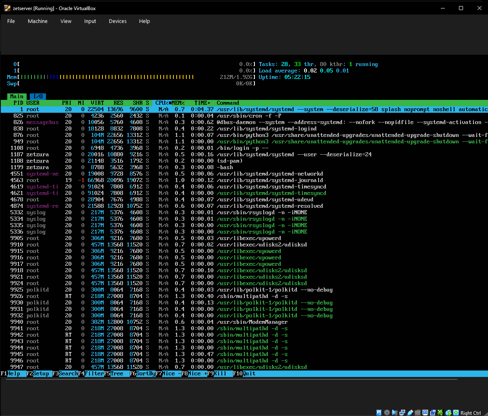
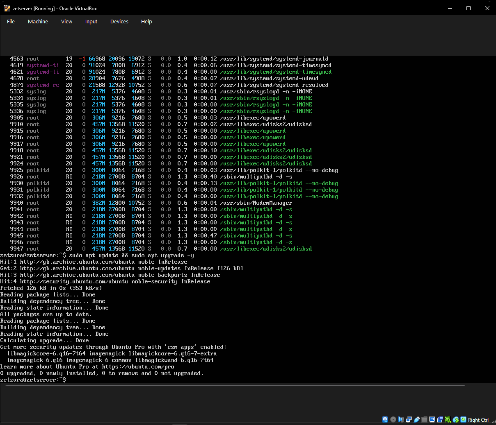

# Week 4 – Software Installation & Final Audit

## 1. Objective
The final week focused on installing system monitoring tools to verify the server's health and performing a final update to ensure the environment is optimized and secure.

## 2. System Information Tool (Neofetch)
I installed **Neofetch** to generate a comprehensive overview of the operating system and hardware configuration directly in the terminal.
* **Command used:** `sudo apt install neofetch -y`

*Above: Neofetch output displaying Ubuntu 24.04.3 LTS, Kernel 6.8.0-90, and resource allocation.*

## 3. Real-Time Resource Monitoring (Htop)
To monitor CPU and Memory consumption in real-time, I installed and configured **htop**.
* **Command used:** `sudo apt install htop -y`

*Above: Htop interface showing stable system performance and low resource overhead during idle state.*

## 4. Final System Maintenance
I performed a final check of the Ubuntu repositories to ensure all security patches and software are at their latest versions.
* **Command used:** `sudo apt update && sudo apt upgrade -y`

*Above: Terminal output confirming all system packages are fully up to date.*

---

## 5. Project Conclusion
Over the past four weeks, I have successfully:
1. **Deployed** a headless Ubuntu 24.04 LTS Server.
2. **Secured** the system with a dedicated administrative user (`zetzura`) and restricted root access.
3. **Configured** remote management via SSH and hardened the network with a UFW firewall.
4. **Verified** system stability and health using Neofetch, Htop, and system updates.

The server is now fully prepared for hosting applications or further development.

---
[Back to Home](./index.html)
