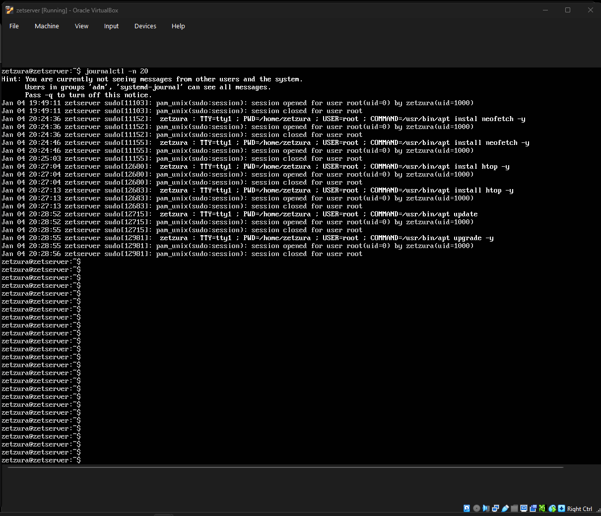

# Week 5 – System Logging & Troubleshooting

## 1. Objective
This week focused on monitoring system health through logs and ensuring the server remains secure, stable, and up-to-date.

## 2. System Log Analysis
I used the `journalctl` utility to review recent system events. This allows me to verify that all services, background tasks, and user sessions (such as the installation of htop and neofetch) were handled correctly by the OS.
* **Command used:** `journalctl -n 20`

*Above: Log output showing successful service activity and command history.*

## 3. System Maintenance & Health Check
To ensure the server is ready for production, I performed a final verification to ensure the system is fully patched. Regular updates are a critical security practice.
* **Command used:** `sudo apt update && sudo apt upgrade -y`

*Above: Terminal output confirming all packages are currently up to date.*

---
[Back to Home](./index.html)
