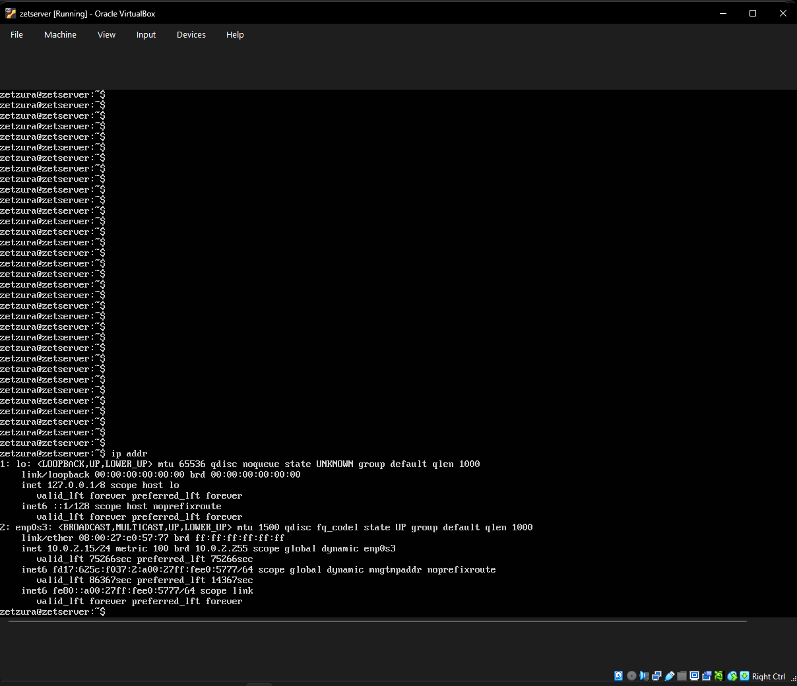
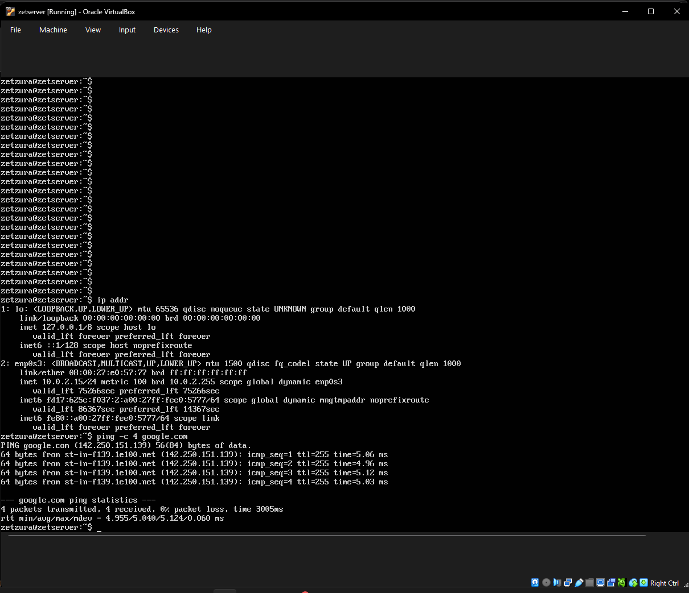
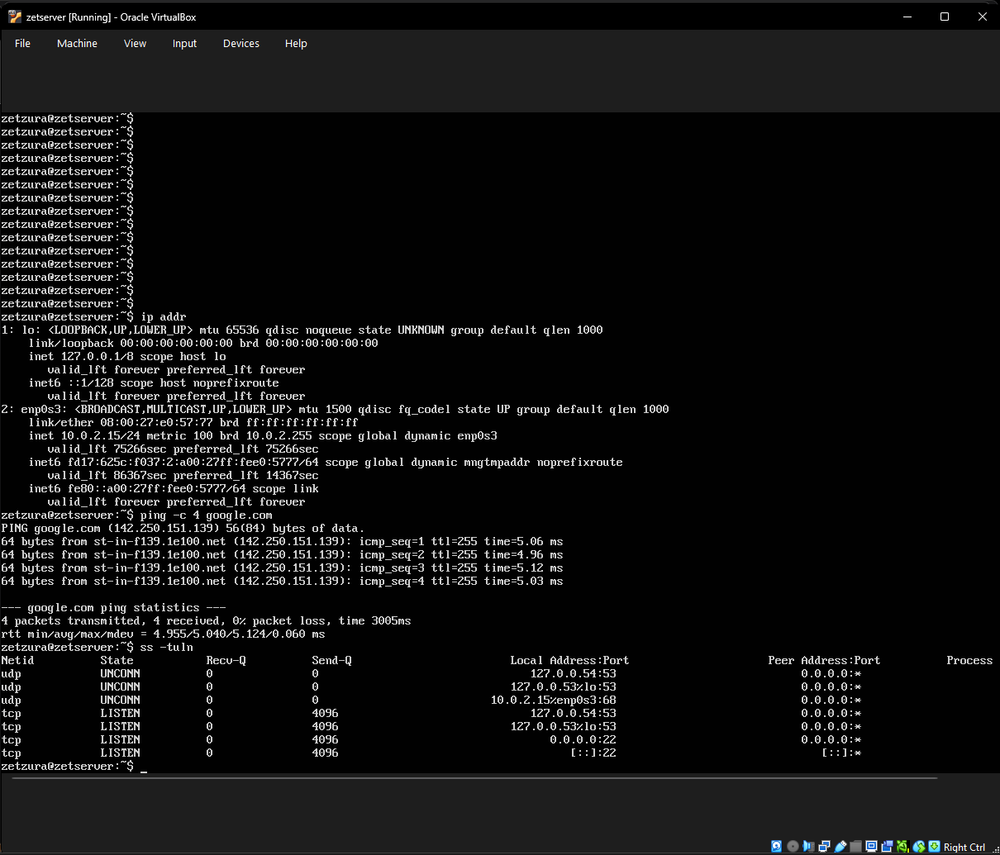

# Week 6 – Network Configuration & Diagnostics

## 1. Objective
This week focused on verifying the server's network configuration, testing external connectivity, and auditing active network ports to ensure secure communication.

## 2. IP Address Verification
I used the `ip addr` command to identify the server's network interfaces and verify the assigned IP address within the VirtualBox NAT environment.
* **Command used:** `ip addr`

*Above: Network interface details showing the loopback address and the primary Ethernet interface (enp0s3).*

## 3. Connectivity Testing
To ensure the server can reach external repositories for updates and software management, I performed a connectivity test using the ICMP protocol.
* **Command used:** `ping -c 4 google.com`

*Above: Successful ping test showing 0% packet loss and stable response times.*

## 4. Port and Service Audit
I audited the server's listening ports to confirm that the SSH service is active and available for remote management while ensuring no unnecessary services are exposed.
* **Command used:** `ss -tuln`

*Above: Socket statistics showing the server is listening on port 22 (SSH) for both IPv4 and IPv6.*

---
[Back to Home](./index.html)
