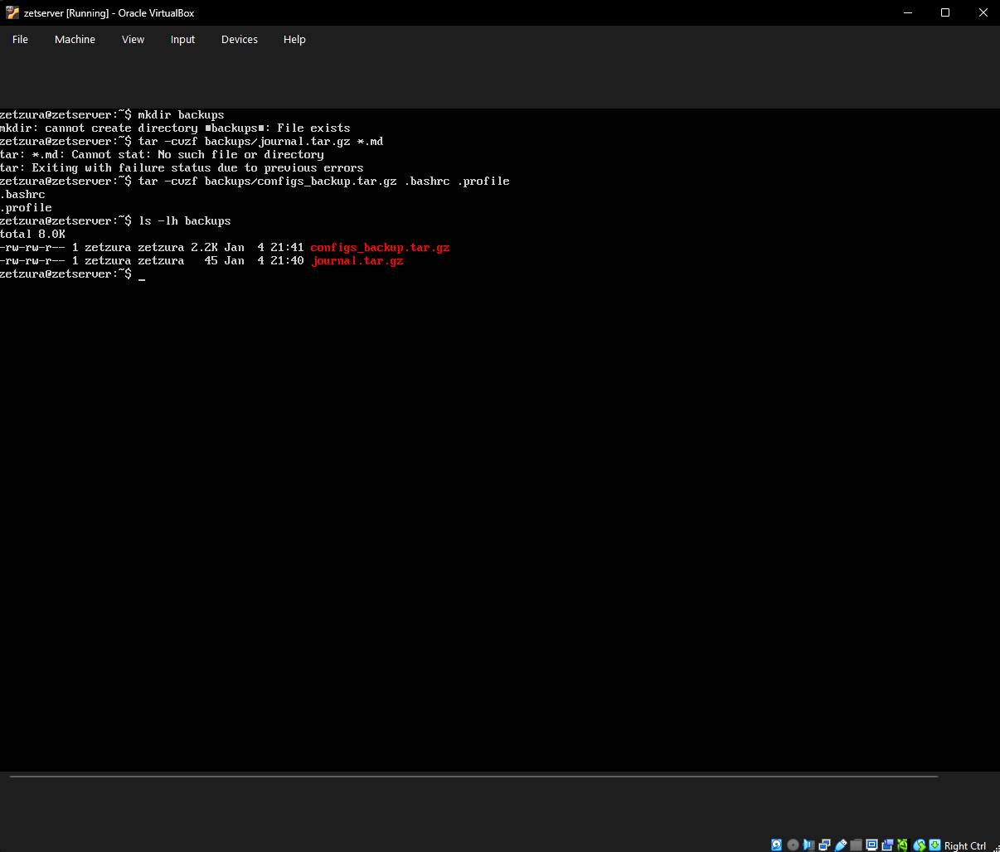

# Week 7 – Data Backup & Recovery

## 1. Objective
The final week of the project focused on implementing a robust data backup strategy. Learning to archive critical system configuration files is an essential skill for any server administrator to ensure data integrity and disaster recovery.

## 2. Backup Implementation
I utilized the `tar` (Tape Archive) utility to create a compressed backup of essential user configuration files. By targeting `.bashrc` and `.profile`, I ensured that my environment settings are preserved.
* **Command used:** `tar -cvzf backups/configs_backup.tar.gz .bashrc .profile`

## 3. Verification and Storage
I verified the success of the backup by listing the contents of the `backups` directory. This confirmed the creation of the compressed archive and allowed me to check the final file size.
* **Command used:** `ls -lh backups`

*Above: Terminal output confirming the successful creation and storage of the 'configs_backup.tar.gz' file.*

## 4. Final Project Conclusion
This concludes the 7-week deployment and configuration of the Ubuntu 24.04 LTS Server. Throughout this course, I have successfully demonstrated the ability to install, secure, monitor, and maintain a Linux-based server environment.

---
[Back to Home](./index.html)
